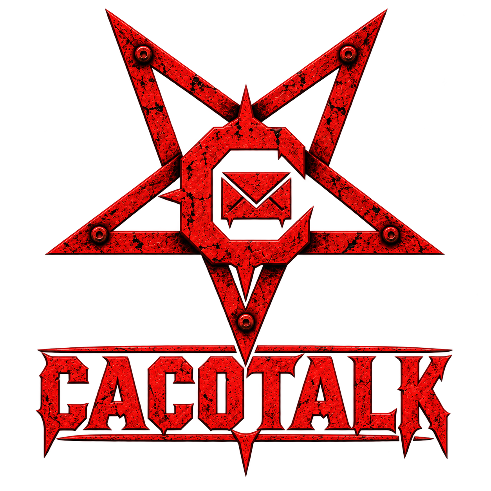
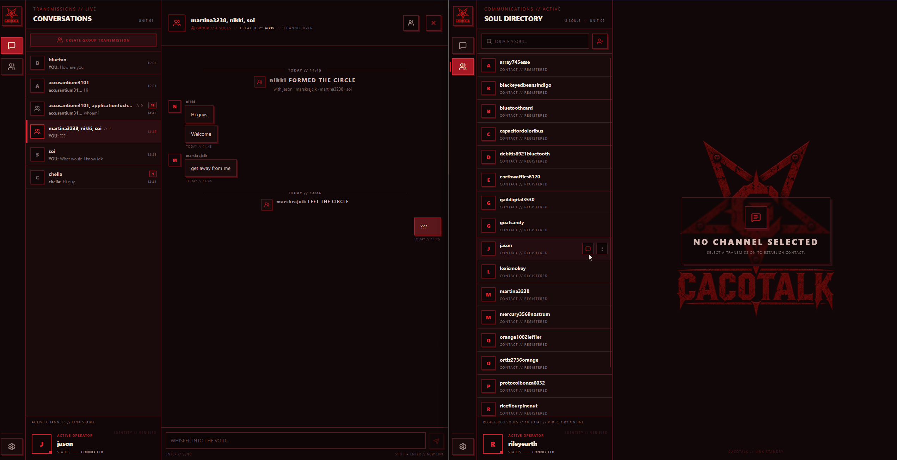
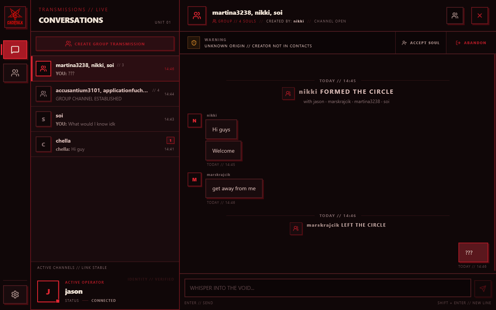
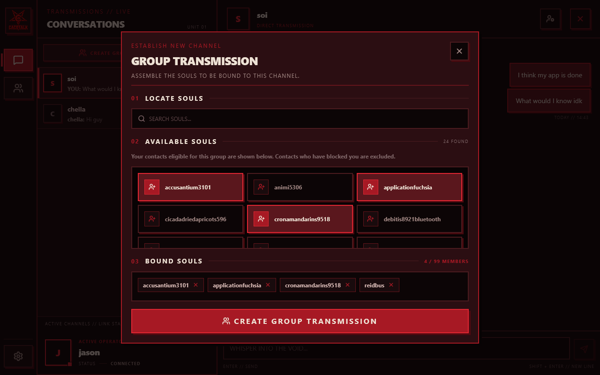
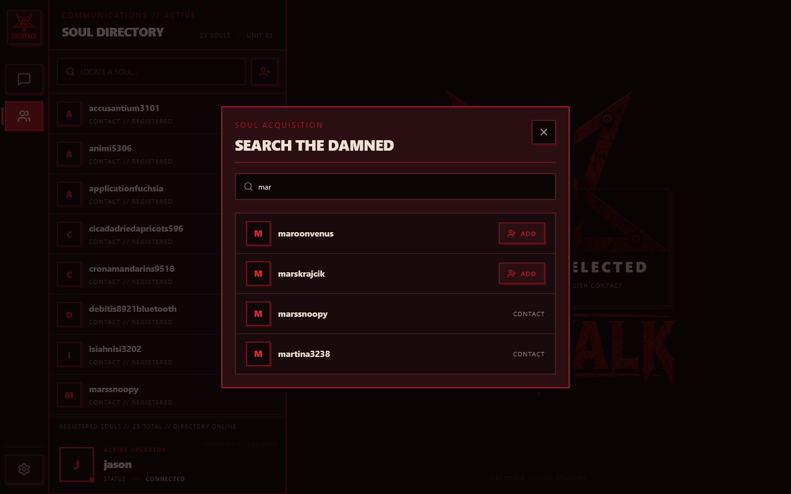

<p align="center">
  
</p>

# CacoTalk-Messenger

CacoTalk is a real-time web messenger: Spring Boot backend, React + TypeScript frontend, PostgreSQL for persistence, Redis for sessions and rate limiting, STOMP over WebSocket for realtime delivery.

The spiritual successor of [CocaTalk](https://www.github.com/jason7599/cocatalk-messenger), an earlier messenger project that reached a functional state but eventually became too difficult to maintain and expand.

Rest in Peace, CocaTalk.

CacoTalk was rebuilt from the ground up with a stronger focus on clear documentation and maintainability — see [docs](./docs) for the design document, schema notes, full API reference, and devlogs written while building it.

## Currently live at [cacotalk.lol](https://cacotalk.lol)

Hobby development, so data may be reset occasionally.

## Features

- Account registration/login, session-based auth (Redis-backed, `HttpOnly` cookie)
- Contacts
- Blocking
- Direct conversations
- Group conversations with membership control
- Realtime message delivery and conversation state sync over WebSocket
- Automatic reconnect with state resync after connection loss
- Per-user read tracking (unread divider, acked-read sync across a user's own open sessions)
- Message content encrypted at rest (AES/CTR, random IV per message)
- Per-user message rate limiting (Redis fixed window)
- Responsive layout (desktop + mobile)

See [`docs/SDD.md`](./docs/SDD.md) for the full functional scope and the main user flows, and [`docs/api`](./docs/api) for the complete API reference (REST + WebSocket).

## Screenshots

<p align="center">
  
  
  
  
</p>


## Tech Stack

| Area | Tech |
|---|---|
| Backend | Spring Boot 4, Java 21, Spring Data JPA, Spring Security, Flyway |
| Frontend | React 19 + TypeScript, Zustand, Tailwind, Vite |
| Database | PostgreSQL |
| Sessions / Rate limiting | Redis |
| Realtime | STOMP over WebSocket (`@stomp/stompjs` client, Spring's in-memory simple broker server-side) |

## Project Structure

```
backend/   Spring Boot application
frontend/  React + TypeScript application
docs/      Design doc, schema notes, API reference, and devlogs
```

## Docs

- [`docs/SDD.md`](./docs/SDD.md) — software design document: scope, main flows, architecture decisions
- [`docs/schema.md`](./docs/schema.md) — database schema
- [`docs/api/`](./docs/api) — full API reference (REST endpoints, error codes, WebSocket/realtime contract)
- [`docs/devlog/`](./docs/devlog) — devlogs written while building this, covering the reasoning behind the gnarlier decisions (concurrency control, message encryption, CORS/CSRF, etc.)


## Acknowledgements

Most of the frontend design, mobile layout and many parts of the UI were built with massive help from Claude (Anthropic).

The architecture, backend, data model, and realtime/sync logic are my own.