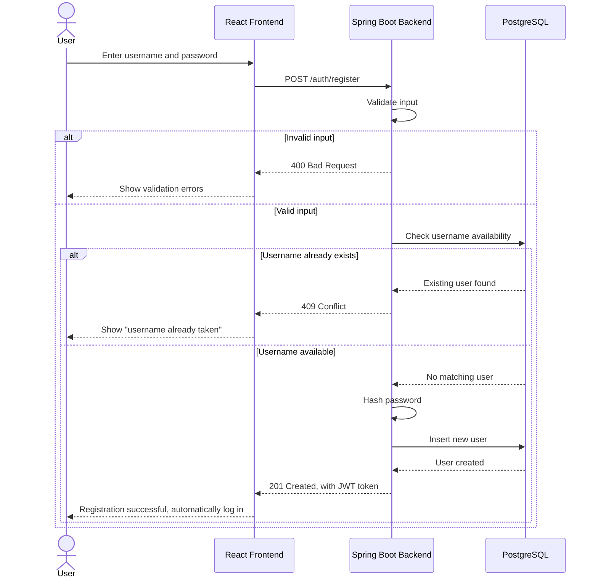
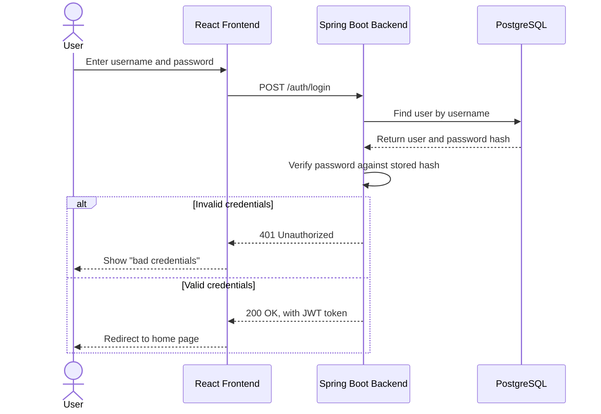

# Use Cases

## User Register

```mermaid
sequenceDiagram
    actor U as User
    participant FE as React Frontend
    participant BE as Spring Boot Backend
    participant DB as PostgreSQL

    U->>FE: Enter username and password
    FE->>BE: POST /auth/register
    BE->>BE: Validate input

    alt Invalid input
        BE-->>FE: 400 Bad Request
        FE-->>U: Show validation errors
    else Valid input
        BE->>DB: Check username availability

        alt Username already exists
            DB-->>BE: Existing user found
            BE-->>FE: 409 Conflict
            FE-->>U: Show "username already taken"
        else Username available
            DB-->>BE: No matching user
            BE->>BE: Hash password
            BE->>DB: Insert new user
            DB-->>BE: User created
            BE-->>FE: 201 Created, with JWT token
            FE-->>U: Registration successful, automatically log in
        end
    end
```

## User Login

```mermaid
sequenceDiagram
    actor U as User
    participant FE as React Frontend
    participant BE as Spring Boot Backend
    participant DB as PostgreSQL

    U->>FE: Enter username and password
    FE->>BE: POST /auth/login
    BE->>DB: Find user by username
    DB-->>BE: Return user and password hash
    BE->>BE: Verify password against stored hash

    alt Invalid credentials
        BE-->>FE: 401 Unauthorized
        FE-->>U: Show "bad credentials"
    else Valid credentials
        BE-->>FE: 200 OK, with JWT token
        FE-->>U: Redirect to home page
    end
```

